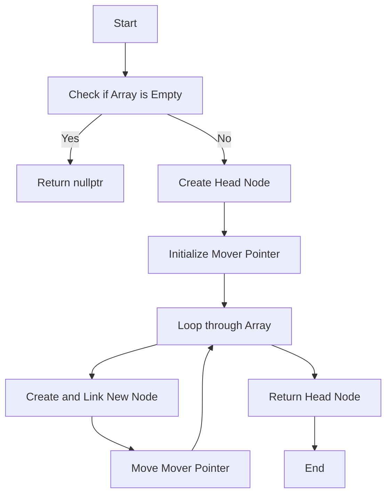

---
 
# Constructing a Linked List from an Array in C++

Linked lists are an important data structure in computer science. They are collections of nodes where each node stores a value and a pointer to the next node. In this blog post, we will walk through how to construct a linked list from an array in C++ and visualize the process with flowcharts and diagrams.

## What is a Linked List?

A linked list is a **linear data structure** where each element (node) contains two parts:
1. **Data**: The value or information stored in the node.
2. **Next**: A pointer that holds the address of the next node in the list.

### Node Structure

The basic structure of a node in a linked list looks like this:

```cpp
class Node {
public:
    int data;      // Stores the value
    Node* next;    // Pointer to the next node

    // Constructor to initialize a node
    Node(int val) {
        data = val;
        next = nullptr;
    }
};
```

### What We're Doing

We are given an **array of integers**, and we need to **construct a linked list** using this array. For example:

**Input Array**: `[1, 2, 3, 4, 5]`

**Output Linked List**:
```
1 -> 2 -> 3 -> 4 -> 5 -> NULL
```

## Steps to Construct a Linked List from an Array

### Step 1: Create the Head Node
The first node in the linked list is always the head. We create a node with the first value from the array and set it as the head.

### Step 2: Traverse and Link Remaining Nodes
Next, we create nodes for the rest of the array elements and link them to the current node. We move a pointer (let’s call it `mover`) to each new node as we create them.

### Step 3: Return the Head of the List
Finally, after all nodes are created and linked, we return the **head** node, which points to the entire linked list.

## The Code

Here’s the C++ code to construct the linked list from the array:

```cpp
class Solution {
public:
    Node* constructLL(vector<int>& arr) {
        int n = arr.size();
        if (n == 0) return nullptr;  // Handle empty array case

        // Create the first node (head)
        Node* head = new Node(arr[0]);
        Node* mover = head;  // Pointer to traverse the list

        // Create and link remaining nodes
        for (int i = 1; i < n; i++) {
            mover->next = new Node(arr[i]);  // Create and link new node
            mover = mover->next;  // Move to the new node
        }

        return head;  // Return the head node
    }
};
```

## Visualizing the Process

### Flowchart for Constructing the Linked List

Here’s a flowchart that explains the process step-by-step:



### Diagrams of Linked List Creation

#### **Step 1: Creating the First Node**
When the array is `[1, 2, 3, 4, 5]`, the first node is created with the value `1`:

```
head → [1 | next] → NULL
```

#### **Step 2: Adding the Second Node**
Now we add the second node with the value `2` and link it to the first node:

```
head → [1 | next] → [2 | next] → NULL
```

#### **Step 3: Adding the Third Node**
Next, we add the third node with the value `3`:

```
head → [1 | next] → [2 | next] → [3 | next] → NULL
```

And so on, until the entire linked list is constructed:

```
head → [1 | next] → [2 | next] → [3 | next] → [4 | next] → [5 | next] → NULL
```

## Time Complexity and Space Complexity

### Time Complexity: O(n)
- We traverse the array once to create the linked list, where `n` is the size of the array.

### Space Complexity: O(n)
- We allocate `n` new nodes, each taking constant space.

## Conclusion

Constructing a linked list from an array in C++ is a straightforward process involving the creation of new nodes and linking them together using pointers. This technique is widely used in algorithms and data structure manipulations.

### Key Concepts:
- **Node**: Stores data and a pointer to the next node.
- **Head**: Points to the first node in the linked list.
- **Pointer (`mover`)**: Helps to traverse and link nodes.

Now you can easily create a linked list from any array in C++!

---

### **Further Reading**
- [Linked List Basics](https://en.wikipedia.org/wiki/Linked_list)
- [C++ Memory Management and Pointers](https://www.geeksforgeeks.org/cpp-memory-management/)

---

Feel free to experiment with the code and adapt it to your needs! Happy coding! 😄


---

### Key Elements Included in the Blog:
- **Step-by-Step Explanation**: The blog explains the logic of linked list creation from an array.
- **Code**: C++ code to create the linked list.
- **Flowchart**: A flowchart visualizing the process of linked list creation.
- **Diagrams**: Simple diagrams to show the list as it grows.
- **Time and Space Complexity**: A quick analysis of the efficiency of the algorithm.

 
